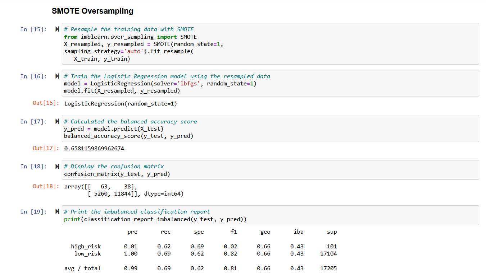

# Credit_Risk_Analysis

## Overview
The purpose of this project was to analyze a data set from LendingClub, a peer-to-peer lending services company, to determine if certain machine learning sampling models are appropriate for use in predicting credit risk.

The models (from *imbalanced-learn* and *scikit-learn*) under investigation are:
- RandomOverSampler
- SMOTE
- ClusterCentroids
- SMOTEENN
- BalancedRandomForestClassifier
- EasyEnsembleClassifier

## Results

 *RandomOverSampler* Algorithm
- balaned accuracy score: 0.66
- precision: 0.01
- recall: 0.72

*SMOTE* Algorithm
- balaned accuracy score: 0.66
- precision: 0.01
- recall: 0.62

*ClusterCentroids* Algorithm
- balaned accuracy score: 0.54
- precision: 0.01
- recall: 0.69

*SMOTEENN* Algorithm
- balaned accuracy score: 0.67
- precision: 0.01
- recall: 0.77

*RandomForestClassifier* Algorithm
- balaned accuracy score: 0.79
- precision: 0.03
- recall: 0.70

*EasyEnsembleClassifier* Algorithm
- balaned accuracy score: 0.93
- precision: 0.09
- recall: 0.92

## Summary

Credit risk is an inherently unbalanced classification because good loans far outnumber risky loans. The challenge here was to find a technique that would properly train the machine learning models to accurately identify risky loans even though they represent an extreme minority of the data set. 

Of the six algorithms run, the EasyEnsembleClassifier had the best outcomes. Its balanced accuracy score was clearly the highest at 0.93. It's precision and recall results were also the highest of all the models. 

Being the highest is a relative concept, though. Precision is the measure of how reliable a positive classification is and, in the case of identifying a few high-risk loans among thousands of low-risk loans, it's the critical factor. Even though the other five models performed worse than the EasyEnsembleClassifier, this model only returned a precision score of 0.09. In other words, it correctly identified high-risk loans less than 10% of the time. 

For this reason, we cannot recommend the use of any of these models to perform the task that LendingClub has requested of accurately predicting credit risk. 

